<p align="center">
  
</p>

<h1 align="center">Codex Usage Monitor</h1>

<p align="center">
  A lightweight Windows tray monitor for Codex 5-hour and weekly limits, CPU, and RAM usage.
</p>

<p align="center">
  <a href="README.md">English</a> ·
  <a href="readme/README.ko.md">한국어</a> ·
  <a href="readme/README.zh-CN.md">简体中文</a> ·
  <a href="readme/README.zh-TW.md">繁體中文</a> ·
  <a href="readme/README.ja.md">日本語</a>
</p>

<p align="center">
  
  
  <a href="LICENSE"></a>
</p>

<p align="center">
  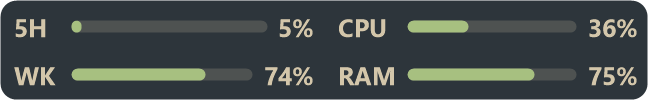
</p>

## Features

- Codex 5-hour and weekly quota percentages and reset countdowns
- CPU and RAM usage
- Independent 5-hour and weekly threshold notifications with quiet hours
- Six styles, 28 Codex color palettes, and system/light/dark screen modes
- Drag-and-drop panel ordering and three appearance presets
- English, Korean, Simplified Chinese, and Japanese
- Local `codex app-server` integration without webpage scraping or auth-file access

## Compact Bar

The Compact Bar keeps the main readings visible at a glance: **5H**, **WK**, **CPU**, and **RAM**. Each metric can show a percentage, a progress bar, or both.

### Rearrange panels

Drag a panel in the Appearance preview onto another panel to swap their positions. The preview keeps the 5-hour and weekly reset countdown panels visible while you arrange the layout. Hidden panels do not reserve an empty slot.

<p align="center">
  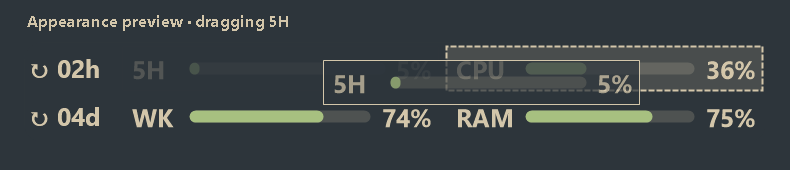
</p>

### Reset-time tooltip

Hover anywhere over the Compact Bar to see the exact 5-hour and weekly reset dates. The tooltip follows the nearest visible edge of the bar and moves above or below it to stay on screen.

<p align="center">
  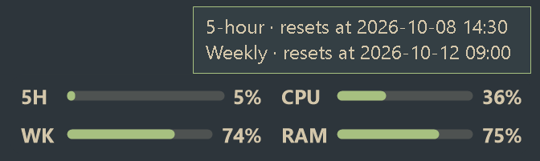
</p>

## Appearance

### Screen mode

Follow the Windows theme automatically with **System**, or keep the Compact Bar in **Dark** or **Light** mode. The previews below use the Everforest palette.

<p align="center">
  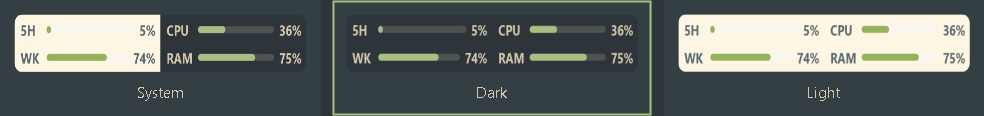
</p>

<details>
<summary><strong>Color themes</strong> — 28 palettes</summary>

Each palette updates the background, text, accent, fill, and track colors together. Dark- and light-mode variants are available where the source theme provides both.

<p align="center">
  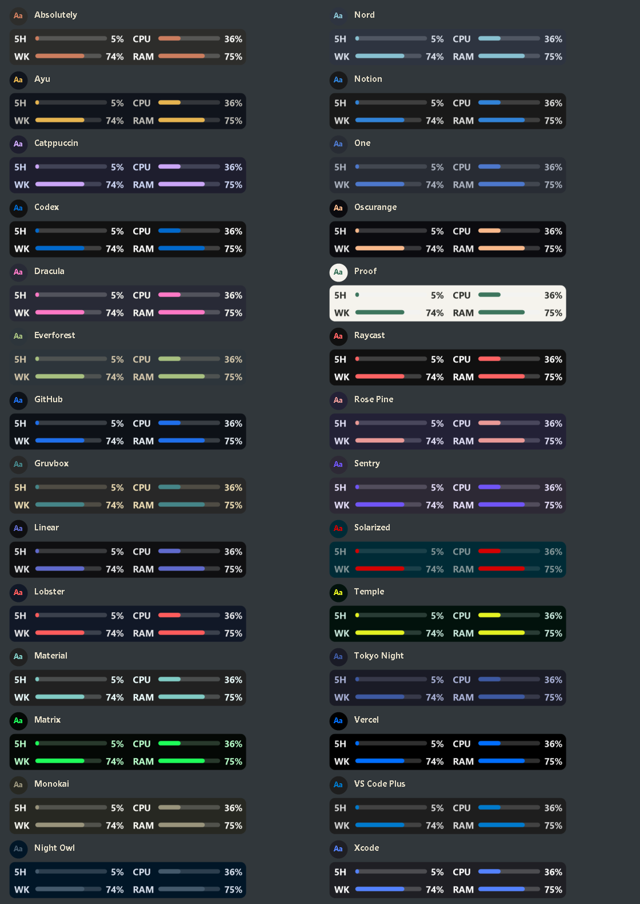
</p>

</details>

<details>
<summary><strong>Bar styles</strong> — 6 layouts</summary>

All style previews use the Everforest palette in Dark mode.

| | |
|---|---|
| **Light**<br>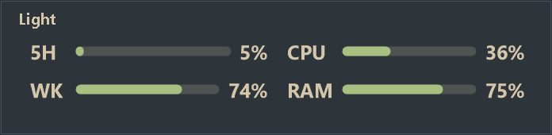 | **Label boxes**<br>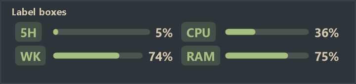 |
| **Neon glow**<br>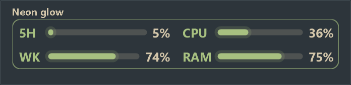 | **Compact rows**<br>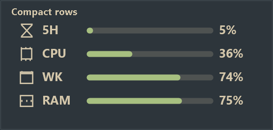 |
| **Gradient**<br>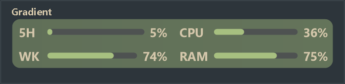 | **Minimal icons + text**<br>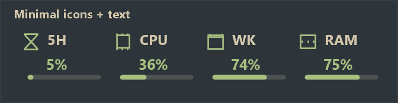 |

</details>

## Install

Requirements:

- Windows 10 or 11, 64-bit
- [.NET 8 SDK](https://dotnet.microsoft.com/download/dotnet/8.0) when building from source
- Codex CLI installed and signed in

```powershell
npm install -g @openai/codex
codex login
codex login status
```

Download or clone this repository, then run `install.cmd`. The installer builds the app, installs it under `%LOCALAPPDATA%\Programs\CodexUsageMonitor`, and creates a Start menu shortcut.

Settings are stored at `%LOCALAPPDATA%\CodexUsageMonitor\settings.json`. The app checks stable GitHub Releases at startup and every six hours; updates can also be checked under **Settings → About**.

## Controls and settings

- Left-click the tray icon to view detailed usage.
- Right-click the tray icon to refresh, show or hide the Compact Bar, open settings, or exit.
- Drag the Compact Bar to move it; right-click it to refresh, open settings, or reset its position.
- Double-click the tray icon or Compact Bar to open settings.

The **Appearance** tab provides a live preview. Drag panels in the preview to swap their positions, then click the background, a panel, or an element to edit it. Metric values can show a percentage, a fill bar, or both. Hidden elements remain translucent in the preview.

The background section includes a transparent-background toggle and an RGBA color editor. With transparency enabled, only the background is hidden; labels and graphs remain visible. Reset-panel settings can independently show or hide the `5H` and `WK` prefixes.

Advanced settings only contain the Codex executable path. Leave it as `codex` unless Codex startup fails; in that case, use the full path returned by `where.exe codex`.

## Build

```powershell
dotnet build CodexUsageMonitor.csproj
powershell -ExecutionPolicy Bypass -File .\build.ps1
```

The publish output is written to `bin\Release\net8.0-windows\win-x64\publish`.

## Privacy and troubleshooting

The app calls `account/rateLimits/read` and `account/usage/read` through the local `codex app-server`. It does not store an API key.

If Codex usage is unavailable, run `codex login status`, sign in again if needed, and check the Codex executable path in Advanced settings. If the Compact Bar is missing, enable it from the tray menu or reset its position. **Settings → About → Copy diagnostics** copies the information needed for troubleshooting.

## License

Released under the [MIT License](LICENSE).
