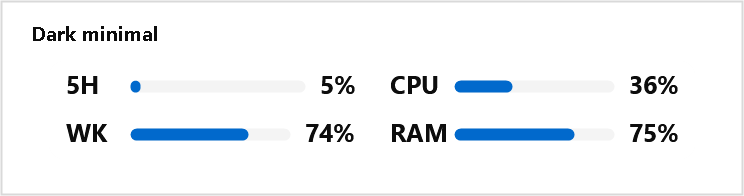
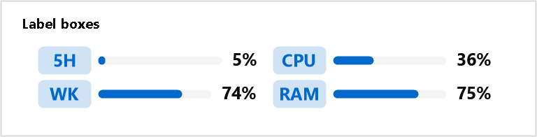
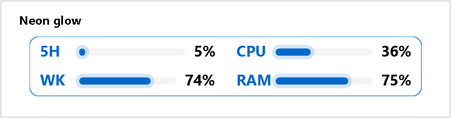
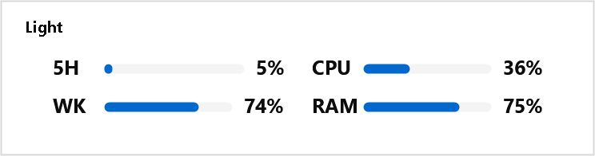
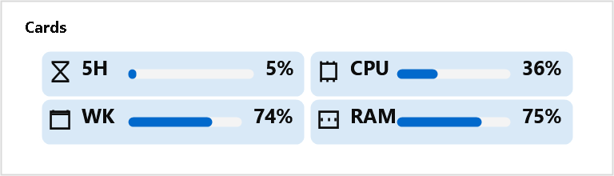
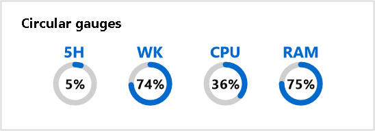
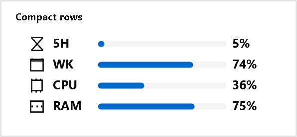
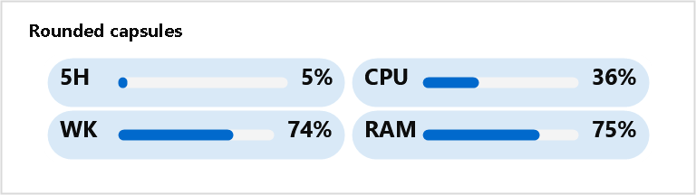
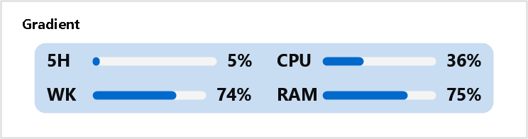
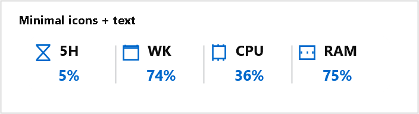

<p align="center">
  
</p>

<h1 align="center">Codex Usage Monitor</h1>

<p align="center">
  <strong>Codex の上限とシステム負荷を、いつでもひと目で。</strong><br>
  5時間・週間上限と CPU・RAM 使用率を表示する軽量な Windows トレイモニターです。
</p>

<p align="center">
  <a href="../README.md">English</a> ·
  <a href="README.ko.md">한국어</a> ·
  <a href="README.zh-CN.md">简体中文</a> ·
  <a href="README.ja.md">日本語</a>
</p>

<p align="center">
  
  
  
  <a href="../LICENSE"></a>
</p>

<p align="center">
  <a href="#quick-start">クイックスタート</a> ·
  <a href="#features">主な機能</a> ·
  <a href="#styles">スタイル</a> ·
  <a href="#settings">設定</a> ·
  <a href="#privacy">プライバシー</a> ·
  <a href="#troubleshooting">トラブルシューティング</a>
</p>

<p align="center">
  
</p>

<p align="center"><sub>左に 5H・WK · 右に CPU・RAM · 好きな位置へドラッグ</sub></p>

---

<a id="features"></a>

## ✨ ひと目でわかる機能

| | 機能 | できること |
|---|---|---|
| 📊 | **Codex 上限** | 5時間・週間上限の残りまたは使用済みパーセント |
| 🖥️ | **システム使用率** | 個別に更新される CPU・RAM 使用率 |
| 🔔 | **制限通知** | 通知しない時間帯に対応した残り 20%・10%・5% の一回通知 |
| 🎨 | **10スタイル × 28カラーテーマ** | ブラック／ホワイトモードとCodexアプリのパレット |
| 💾 | **3つのプリセット** | 好みの外観をすぐに保存・復元 |
| 🌍 | **4言語** | 英語・韓国語・簡体字中国語・日本語 |
| 🔒 | **ローカル・プライベート** | `codex app-server` を使用し、Webスクレイピングや認証ファイルへのアクセスなし |

Compact Bar は2列構成です。1列目に `5H` と `WK`、2列目に `CPU` と `RAM` を表示します。各項目はパーセント、FillBar、または両方を表示できます。

<a id="styles"></a>

## 🎨 スタイルギャラリー

以下のプレビューは、すべて標準の **Codex Light** カラーテーマでレンダリングしています。他のカラーテーマはアプリ内で選択でき、このギャラリーには重複して掲載しません。

| | |
|---|---|
| **ダークミニマル**<br> | **ラベルボックス**<br> |
| **ネオングロー**<br> | **ライト**<br> |
| **カード**<br> | **円形ゲージ**<br> |
| **コンパクトバー**<br> | **丸型カプセル**<br> |
| **グラデーション**<br> | **ミニマルアイコン + テキスト**<br> |

<a id="quick-start"></a>

## 🚀 クイックスタート

### 必要なもの

次の環境が必要です。

- 64ビット版 Windows 10 または Windows 11
- ダウンロードしたソースをビルドするための [.NET 8 SDK](https://dotnet.microsoft.com/download/dotnet/8.0)
- Codex CLI のインストールと ChatGPT へのログイン

PowerShell で Codex CLI を準備します。すでに `codex` がインストール済みなら、インストールコマンドは省略できます。

```powershell
npm install -g @openai/codex
codex login
codex login status
```

### インストール

1. GitHub で **Code → Download ZIP** を選択し、ZIP を展開します。またはリポジトリをクローンします。
2. 展開した `codex-usage-monitor` フォルダーを開きます。
3. `install.cmd` をダブルクリックします。
4. ビルドが完了するまで待ちます。インストール後、アプリは自動的に起動します。
5. 次回からは Windows のスタートメニューで **Codex Usage Monitor** を検索して起動します。

インストール先：

```text
アプリ:       %LOCALAPPDATA%\Programs\CodexUsageMonitor\CodexUsageMonitor.exe
ショートカット: スタートメニュー\プログラム\Codex Usage Monitor
設定ファイル:   %LOCALAPPDATA%\CodexUsageMonitor\settings.json
```

インストール版は起動時と 6 時間ごとに GitHub の正式リリースを確認します。新しいバージョンがある場合は Windows 通知が表示されます。**設定 → 情報** で **v… に更新** を選択すると、リリースファイルをダウンロードし、SHA-256 チェックサムを検証してからインストール済みアプリを置き換え、自動的に再起動します。チェックサムはダウンロードの整合性を確認しますが、発行者署名の代わりにはなりません。設定ファイルは維持されます。

**設定 → 情報** の **更新を確認** からいつでも手動で確認できます。自動インストールは上記のインストール先から実行した場合のみ利用でき、ソースやデバッグビルドは上書きしません。

v1.1.0 より前のバージョンにはアップデーターが含まれないため、v1.1.0 以降を一度手動でインストールする必要があります。

初回インストール時の UI 言語は英語で、プリセット 1 はラベルボックス／Codexパレット／ブラック／背景 Alpha `0` にあらかじめ設定されます。既存の `settings.json` は上書きされません。

インストール版を削除するには、**設定 → 情報** から **アンインストール** を選択します。確認画面で設定、プリセット、ログを保持するか同時に削除するかを選べます。スタートメニューのショートカットと Windows 自動起動登録も削除されます。

<details>
<summary><strong>手動でビルドする</strong></summary>

<br>

```powershell
dotnet build
```

インストーラーと同じ自己完結型の単一実行ファイルを作成する場合：

```powershell
powershell -ExecutionPolicy Bypass -File .\build.ps1
```

出力先：`bin\Release\net8.0-windows\win-x64\publish\CodexUsageMonitor.exe`

</details>

<a id="controls"></a>

## 🖱️ 起動と操作

アプリは通常のタスクバーウィンドウではなく、通知領域で動作します。

- トレイアイコンを左クリック：詳細な使用状況を表示
- トレイアイコンを右クリック：状態、更新、Compact Bar の切り替え、設定、終了
- トレイアイコンまたは Compact Bar をダブルクリック：設定を開く
- Compact Bar を右クリック：更新、設定、または位置のリセット
- Compact Bar をドラッグ：移動して位置を自動保存
- **設定 → 情報**：バージョン、作者、リポジトリ、診断情報、更新、アンインストール

Compact Bar が見えない場合は、トレイアイコンを右クリックして **Compact Bar を表示**を有効にします。

<a id="settings"></a>

## ⚙️ 設定ガイド

### 一般設定

| 設定 | 説明 |
|---|---|
| Compact Bar を表示 | フローティング表示の 2×2 モニターを表示または非表示にします。 |
| Windows 起動時に自動実行 | Windows のスタートアップに登録または解除します。 |
| 言語 | 英語、韓国語、簡体字中国語、日本語を選択します。選択すると現在の設定画面がすぐに翻訳され、保存するとアプリ全体に適用されます。 |
| 更新間隔 | Codex 使用量の更新間隔を 30～1,800 秒に設定します。CPU と RAM は個別に更新されます。 |
| 制限しきい値の通知 | 5時間または週間の残り制限が 20%、10%、5% の範囲に入ったとき、それぞれ一度だけ通知します。制限のリセット時に通知状態もリセットされます。 |
| 通知しない時間帯 | 指定したローカル時間帯はしきい値通知を延期し、終了後に通知します。 |
| 詳細設定 | Codex 実行ファイルのパスを含みます。通常は `codex` のままにし、起動できない場合は `where.exe codex` で表示されるフルパスを入力します。 |

設定画面を開いたまま、外観の変更が Compact Bar にすぐプレビューされます。ドロップダウンでプリセットスロットを選び、**読込**または**スロット保存**を使用します。各スロットにはスタイル、カラーモード、カラーテーマ、背景、表示基準、項目の表示、表示方法、色が保存されます。

パレットには Absolutely、Ayu、Catppuccin、Codex、Dracula、Everforest、GitHub、Gruvbox、Linear、Lobster、Material、Matrix、Monokai、Night Owl、Nord、Notion、One、Oscurange、Proof、Raycast、Rose Pine、Sentry、Solarized、Temple、Tokyo Night、Vercel、VS Code Plus、Xcode があります。ブラック／ホワイトは、各 Codex パレットが実際に提供する明るさだけを表示します。

設定は**一般**、**表示**、**情報**タブに分かれます。表示タブでは、プリセット、外観、表示基準、4項目の設定を1つのスクロール可能なページで編集でき、50～200% のスライダーと 100% リセットボタンも使用できます。スタイル変更では現在の色を保持し、カラーモードまたはカラーテーマを選ぶと、そのテーマの背景・Fill・トラック色が適用されます。円形ゲージの高さは現在のモニターのタスクバーを基準にします。更新の確認とダウンロードには進行表示とキャンセルボタンがあります。

設定は検証済みの一時ファイルを経由して原子的に保存されます。直前の正常なファイルは `settings.json.bak` として保持され、主 JSON が破損した場合はバックアップを復元してトレイ通知で案内します。`SettingsVersion` フィールドは今後の互換移行に使用されます。

### Compact Bar と各項目

**表示**タブでは、Codex 制限を残りパーセントまたは使用済みパーセントのどちらで表示するかを選択します。CPU と RAM は常に現在の使用率です。

`5H`、`WK`、`CPU`、`RAM` の各項目には次の設定があります。

| 設定 | 説明 |
|---|---|
| 表示 | その項目を有効または無効にします。 |
| パーセントのみ | FillBar を表示せず、数値だけを表示します。 |
| FillBar のみ | FillBar だけを表示します。 |
| パーセント + FillBar | 数値と FillBar の両方を表示します。 |
| 塗りつぶし色 | バーの塗りつぶされた部分の色を設定します。 |
| トラック色 | バーの塗りつぶされていない背景色を設定します。 |

**背景**は角丸の Compact Bar 背景だけを変更します。カラーピッカーでは RGBA 値、アルファスライダー、6桁の RGB Hex を使用できます。背景の Alpha を `0` にしても背景だけが透明になり、文字とグラフは表示されたままです。

<a id="privacy"></a>

## 🔒 データとプライバシー

Web ページのスクレイピングや認証ファイルの直接読み取りは行いません。ローカルの `codex app-server` を起動し、公式 JSON-RPC メソッド `account/rateLimits/read` と `account/usage/read` を使用します。API キーは保存しません。

<a id="troubleshooting"></a>

## 🧰 トラブルシューティング

### Codex 使用量を取得できない

`codex login status` を実行してください。必要なら `codex login` で再ログインします。設定の `Codex 実行ファイル`を `where.exe codex` で確認したフルパスに変更することもできます。

### Compact Bar が表示されない

通知領域を確認し、トレイメニューから **Compact Bar を表示**を有効にします。モニター構成が変わると有効な画面内に一部が見えるよう自動補正されます。必要なら **位置をリセット**を選択してください。

### 診断情報を収集する

**設定 → 情報** から **診断情報をコピー**を選択します。アプリのバージョン、app-server の状態、直近の更新・エラー、Windows／DPI／モニター情報、設定とログのパスがコピーされます。

### 再インストールに失敗する

実行中のファイルを置き換えられるように、トレイメニューから Codex Usage Monitor を終了してから `install.cmd` を再実行してください。

## 📄 ライセンス

[MIT License](../LICENSE) の下で公開されています。
