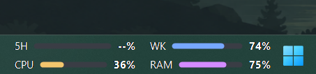

<p align="center">
  
</p>

<h1 align="center">Codex Usage Monitor</h1>

<p align="center">
  <strong>Codex の上限とシステム負荷を、いつでもひと目で。</strong><br>
  5時間・週間上限と CPU・RAM 使用率を表示する軽量な Windows トレイモニターです。
</p>

<p align="center">
  <a href="../README.md">English</a> ·
  <a href="README.ko.md">한국어</a> ·
  <a href="README.zh-CN.md">简体中文</a> ·
  <a href="README.ja.md">日本語</a>
</p>

<p align="center">
  
  
  
  <a href="../LICENSE"></a>
</p>

<p align="center">
  <a href="#quick-start">クイックスタート</a> ·
  <a href="#features">主な機能</a> ·
  <a href="#settings">設定</a> ·
  <a href="#privacy">プライバシー</a> ·
  <a href="#troubleshooting">トラブルシューティング</a>
</p>

<p align="center">
  
</p>

<p align="center"><sub>左に 5H・WK · 右に CPU・RAM · 好きな位置へドラッグ</sub></p>

---

<a id="features"></a>

## ✨ ひと目でわかる機能

| | 機能 | できること |
|---|---|---|
| 📊 | **Codex 上限** | 5時間・週間上限の残りまたは使用済みパーセント |
| 🖥️ | **システム使用率** | 個別に更新される CPU・RAM 使用率 |
| 🎨 | **10スタイル × 2テーマ** | すべての Compact Bar スタイルでブラック・ホワイトを選択 |
| 💾 | **3つのプリセット** | 好みの外観をすぐに保存・復元 |
| 🌍 | **4言語** | 英語・韓国語・簡体字中国語・日本語 |
| 🔒 | **ローカル・プライベート** | `codex app-server` を使用し、Webスクレイピングや認証ファイルへのアクセスなし |

Compact Bar は2列構成です。1列目に `5H` と `WK`、2列目に `CPU` と `RAM` を表示します。各項目はパーセント、FillBar、または両方を表示できます。

<a id="quick-start"></a>

## 🚀 クイックスタート

### 必要なもの

次の環境が必要です。

- 64ビット版 Windows 10 または Windows 11
- ダウンロードしたソースをビルドするための [.NET 8 SDK](https://dotnet.microsoft.com/download/dotnet/8.0)
- Codex CLI のインストールと ChatGPT へのログイン

PowerShell で Codex CLI を準備します。すでに `codex` がインストール済みなら、インストールコマンドは省略できます。

```powershell
npm install -g @openai/codex
codex login
codex login status
```

### インストール

1. GitHub で **Code → Download ZIP** を選択し、ZIP を展開します。またはリポジトリをクローンします。
2. 展開した `codex-usage-monitor` フォルダーを開きます。
3. `install.cmd` をダブルクリックします。
4. ビルドが完了するまで待ちます。インストール後、アプリは自動的に起動します。
5. 次回からは Windows のスタートメニューで **Codex Usage Monitor** を検索して起動します。

インストール先：

```text
アプリ:       %LOCALAPPDATA%\Programs\CodexUsageMonitor\CodexUsageMonitor.exe
ショートカット: スタートメニュー\プログラム\Codex Usage Monitor
設定ファイル:   %LOCALAPPDATA%\CodexUsageMonitor\settings.json
```

更新する場合は、新しいソースを入手し、トレイメニューから実行中のアプリを終了してから `install.cmd` をもう一度実行します。既存の設定は維持されます。

初回インストール時の UI 言語は英語で、プリセット 1 はラベルボックス／ブラック／背景 Alpha `0` にあらかじめ設定されます。既存の `settings.json` は上書きされません。

<details>
<summary><strong>手動でビルドする</strong></summary>

<br>

```powershell
dotnet build
```

インストーラーと同じ自己完結型の単一実行ファイルを作成する場合：

```powershell
powershell -ExecutionPolicy Bypass -File .\build.ps1
```

出力先：`bin\Release\net8.0-windows\win-x64\publish\CodexUsageMonitor.exe`

</details>

<a id="controls"></a>

## 🖱️ 起動と操作

アプリは通常のタスクバーウィンドウではなく、通知領域で動作します。

- トレイアイコンを左クリック：詳細な使用状況を表示
- トレイアイコンを右クリック：状態、更新、Compact Bar の切り替え、設定、終了
- トレイアイコンまたは Compact Bar をダブルクリック：設定を開く
- Compact Bar を右クリック：更新または設定
- Compact Bar をドラッグ：移動して位置を自動保存

Compact Bar が見えない場合は、トレイアイコンを右クリックして **Compact Bar を表示**を有効にします。

<a id="settings"></a>

## ⚙️ 設定ガイド

### 一般設定

| 設定 | 説明 |
|---|---|
| Compact Bar を表示 | フローティング表示の 2×2 モニターを表示または非表示にします。 |
| Compact Bar スタイル | ダークミニマル、ラベルボックス、ネオングロー、ライト、カード、円形ゲージ、コンパクトバー、丸型カプセル、グラデーション、ミニマルアイコン + テキストから選択します。 |
| Windows 起動時に自動実行 | Windows のスタートアップに登録または解除します。 |
| 言語 | 英語、韓国語、簡体字中国語、日本語を選択します。選択すると現在の設定画面がすぐに翻訳され、保存するとアプリ全体に適用されます。 |
| 表示基準 | Codex 制限を残りパーセントまたは使用済みパーセントで表示します。CPU と RAM は常に現在の使用率です。 |
| 更新間隔 | Codex 使用量の更新間隔を 30～1,800 秒に設定します。CPU と RAM は個別に更新されます。 |
| Codex 実行ファイル | 通常は `codex` のままにします。起動できない場合は `where.exe codex` で表示されるフルパスを入力します。 |

設定画面を開いたまま、外観の変更が Compact Bar にすぐプレビューされます。3つのプリセットスロットには、スタイル、ブラック／ホワイトのカラーテーマ、背景、表示基準、項目の表示、表示方法、色を保存できます。**スロット保存**はメインの保存ボタンとは独立してすぐに記録され、適用には**読込**を使用します。

設定は**一般**、**外観**、**表示項目**タブに分かれ、3つのプリセットスロットはすべてのタブの上に常時表示されます。すべてのスタイルでブラックとホワイトのバージョンを選択できます。スタイルまたはカラーテーマを選択すると、対応する既定の背景色と透明度も適用され、その後で好みの値に調整できます。円形ゲージスタイルの高さは、現在のモニターのタスクバーの高さに自動調整されます。

### Compact Bar と各項目

`5H`、`WK`、`CPU`、`RAM` の各項目には次の設定があります。

| 設定 | 説明 |
|---|---|
| 表示 | その項目を有効または無効にします。 |
| パーセントのみ | FillBar を表示せず、数値だけを表示します。 |
| FillBar のみ | FillBar だけを表示します。 |
| パーセント + FillBar | 数値と FillBar の両方を表示します。 |
| 塗りつぶし色 | バーの塗りつぶされた部分の色を設定します。 |
| トラック色 | バーの塗りつぶされていない背景色を設定します。 |

**背景**は角丸の Compact Bar 背景だけを変更します。カラーピッカーでは RGBA 値、アルファスライダー、6桁の RGB Hex を使用できます。背景の Alpha を `0` にしても背景だけが透明になり、文字とグラフは表示されたままです。

<a id="privacy"></a>

## 🔒 データとプライバシー

Web ページのスクレイピングや認証ファイルの直接読み取りは行いません。ローカルの `codex app-server` を起動し、公式 JSON-RPC メソッド `account/rateLimits/read` と `account/usage/read` を使用します。API キーは保存しません。

<a id="troubleshooting"></a>

## 🧰 トラブルシューティング

### Codex 使用量を取得できない

`codex login status` を実行してください。必要なら `codex login` で再ログインします。設定の `Codex 実行ファイル`を `where.exe codex` で確認したフルパスに変更することもできます。

### Compact Bar が表示されない

通知領域を確認し、トレイメニューから **Compact Bar を表示**を有効にします。モニター構成や画面の拡大率を変更した後は、一度オフにしてから再度オンにしてください。

### 再インストールに失敗する

実行中のファイルを置き換えられるように、トレイメニューから Codex Usage Monitor を終了してから `install.cmd` を再実行してください。

## 📄 ライセンス

[MIT License](../LICENSE) の下で公開されています。
